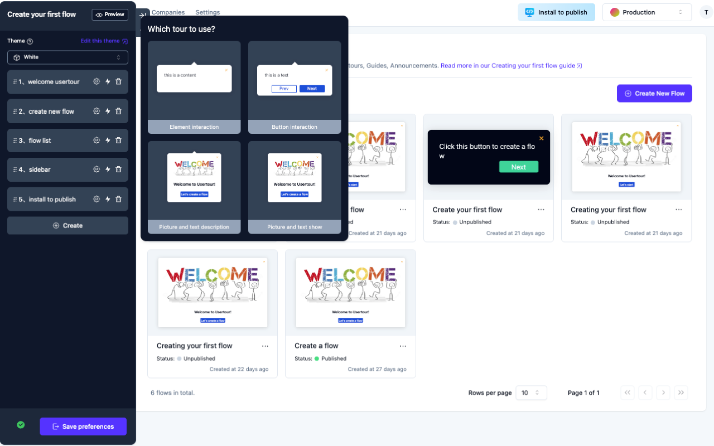

<!-- generated -->

# Usertour

1-Click installation template for Usertour on Easypanel

## Description

Usertour.io is an open-source user onboarding platform that helps developers create interactive product tours, feature introductions, and user guides without writing a single line of code. It allows you to design and deploy interactive walkthroughs, checklists, and tooltips to improve user activation and adoption. The platform provides a visual editor for creating tours, targeting specific user segments, and collecting analytics on user engagement. Usertour.io integrates seamlessly with your application, offering customization options to match your branding and design. With its developer-friendly approach, it enables teams to create, test, and deploy product tours quickly while maintaining a native look and feel.

## Instructions

Login using the email; lisa@simpson.com, password; secret42

## Benefits

- Code-Free Product Tours: Build interactive product tours and onboarding experiences without writing code, saving development time and resources.
- Improved User Adoption: Guide users through your application's features, increasing feature discovery and improving overall user activation.
- Customizable Experience: Tailor the appearance and behavior of your tours to match your brand and application's look and feel.

## Features

- Visual Tour Builder: Design interactive product tours with an intuitive drag-and-drop interface that requires no coding experience.
- User Segmentation: Target specific user groups with tailored onboarding experiences based on user roles, behavior, or other criteria.
- Multi-Format Guidance: Create various types of user guidance including step-by-step tours, feature spotlights, tooltips, and checklists.
- Analytics Dashboard: Track user engagement with your tours and measure completion rates to optimize the onboarding experience.

## Links

- [Website](https://www.usertour.io/)
- [Documentation](https://docs.usertour.io/)
- [Github](https://github.com/usertour/usertour)
- [Template Source](https://github.com/easypanel-io/templates/tree/main/templates/usertour)

## Options

Name | Description | Required | Default Value
-|-|-|-
App Service Name | - | yes | usertour
App Service Image | - | yes | usertour/usertour:0.2.7

## Screenshots

## Change Log

- 2025-03-21 – Initial template release (1.0)
- 2025-07-25 – Version bumped to 0.2.7

## Contributors

- [Ahson Shaikh](https://github.com/Ahson-Shaikh)
