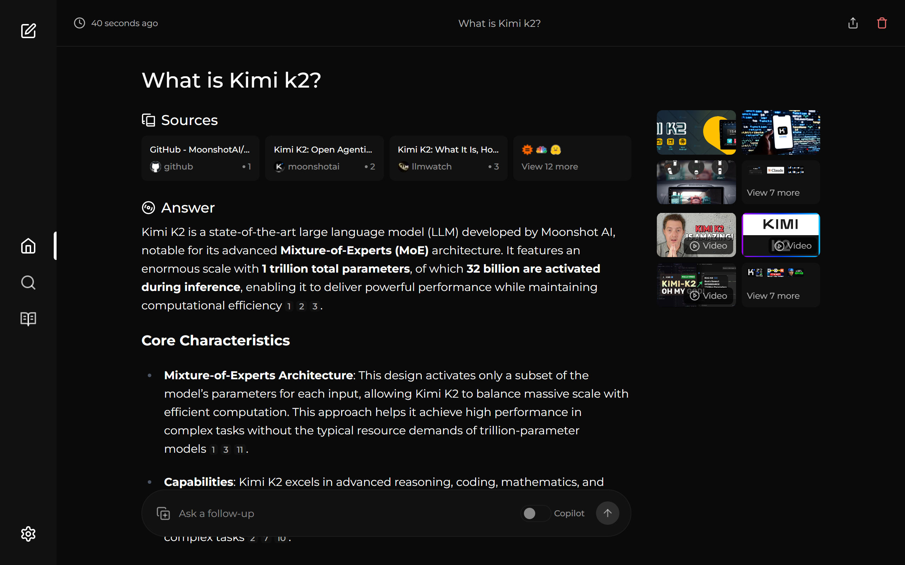

<!-- generated -->

# Vane

1-Click installation template for Vane on Easypanel

## Description

Vane is a privacy focused AI answering engine that combines web search with local and cloud LLM providers. It supports cited answers, file uploads, search history, and configurable model backends while running on your own hardware.

## Instructions

Deploy and open your domain to complete setup from the in-app onboarding screen. The default image includes bundled SearxNG, so no extra search service is required. To use your own SearxNG instance, set SearxNG API URL in the template form. Data persists in /home/vane/data through the mounted volume.

## Benefits

- Privacy Focused Search: Runs locally with search history and app data stored on your own infrastructure.
- Flexible AI Providers: Supports local models via Ollama and cloud providers including OpenAI, Claude, Gemini, and Groq.
- Cited Answers and Research: Delivers source cited responses with multiple search modes for speed, balance, or quality.

## Features

- Bundled SearxNG: Default image includes integrated SearxNG web search without extra service setup.
- File Upload Q&A: Upload documents and ask questions directly from the Vane interface.
- Persistent Local Data: Stores settings and history in /home/vane/data using the mounted volume.

## Links

- [Documentation](https://github.com/ItzCrazyKns/Vane/tree/master/docs)
- [GitHub](https://github.com/ItzCrazyKns/Vane)
- [Template Source](https://github.com/easypanel-io/templates/tree/main/templates/vane)

## Options

Name | Description | Required | Default Value
-|-|-|-
App Service Name | - | yes | vane
App Service Image | Official Vane image pinned to a digest from Docker Hub | yes | itzcrazykns1337/vane:latest
SearxNG API URL (optional) | Use only when running Vane slim or external SearxNG | no | 

## Screenshots

## Change Log

- 2025-04-06 – Initial Template release

## Contributors

- [Ahson Shaikh](https://github.com/Ahson-Shaikh)
