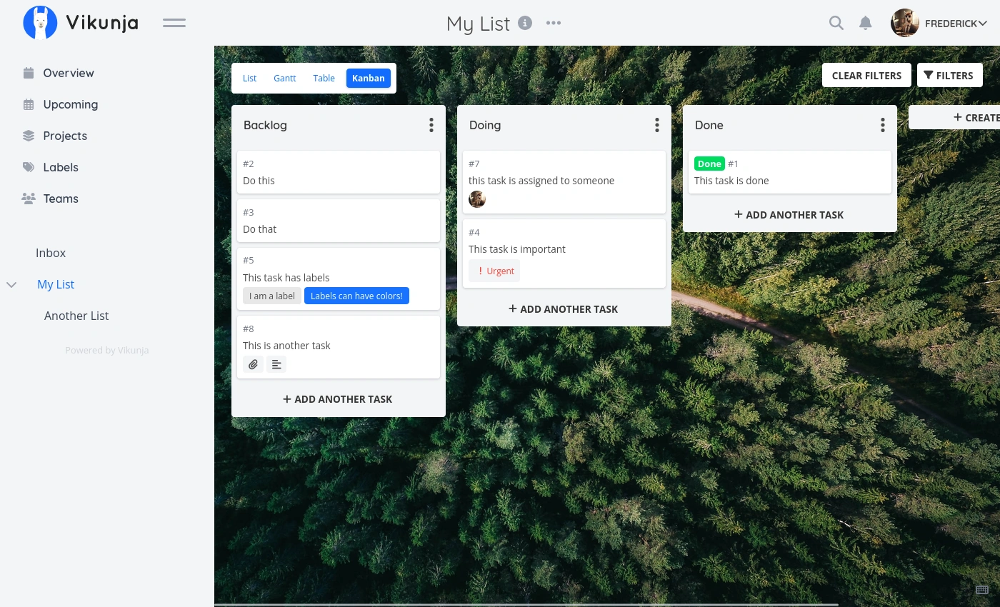

<!-- generated -->

# Vikunja

1-Click installation template for Vikunja on Easypanel

## Description

Vikunja is a self-hosted To-Do list application and task management tool. It provides a clean and intuitive interface for organizing tasks, projects, and team collaboration. With features like task lists, labels, assignees, due dates, and more, Vikunja helps individuals and teams stay organized and productive.

## Instructions

Create a new user and login to the application.

## Benefits

- Self-Hosted Task Management: Keep your tasks and projects private with complete control over your data.
- Team Collaboration: Share projects and collaborate with team members on tasks and goals.
- Feature Rich: Comprehensive task management with labels, due dates, assignees, and more.

## Features

- Task Lists & Projects: Organize tasks into lists and projects for better structure.
- Labels & Categories: Use labels and categories to classify and filter tasks efficiently.
- Team Sharing: Share projects with team members and assign tasks to specific users.
- Due Dates & Reminders: Set due dates and get reminders to stay on top of deadlines.

## Links

- [Documentation](https://vikunja.io/docs/)
- [Github](https://github.com/go-vikunja/vikunja)
- [Template Source](https://github.com/easypanel-io/templates/tree/main/templates/vikunja)

## Options

Name | Description | Required | Default Value
-|-|-|-
App Service Name | - | yes | vikunja
App Service Image | - | yes | vikunja/vikunja:0.24.6

## Screenshots

## Change Log

- 2025-06-10 – Template Release

## Contributors

- [Ahson Shaikh](https://github.com/Ahson-Shaikh)
