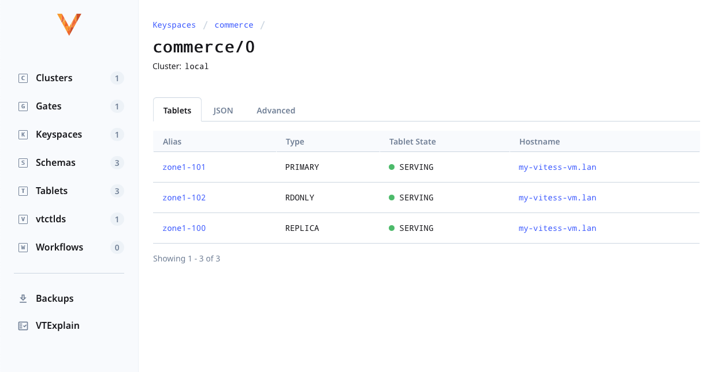

<!-- generated -->

# Vitess

1-Click installation template for Vitess on Easypanel

## Description

Vitess is a database clustering system for horizontal scaling of MySQL. It is designed to make it easier to scale and manage large deployments of MySQL databases. Vitess helps handle sharding, connection pooling, and query routing efficiently, making it a great choice for cloud-native applications and high-traffic websites. It is used by companies like YouTube and Slack to manage massive database workloads. Vitess provides built-in automation, strong consistency, and MySQL compatibility while being resilient to failures and easy to operate at scale.

## Benefits

- Horizontal Scalability: Vitess enables seamless horizontal scaling for MySQL databases. It allows you to shard your database without application-level changes, making it easy to scale as your workload grows.
- MySQL Compatibility: Vitess retains full MySQL compatibility, ensuring that existing MySQL applications can migrate with minimal modifications while benefiting from advanced scalability features.
- High Availability: Vitess ensures high availability through automated failover and robust fault tolerance mechanisms. This makes it a reliable choice for mission-critical applications.

## Features

- Sharding: Vitess provides built-in support for database sharding, allowing you to split data across multiple nodes and maintain performance at scale.
- Connection Pooling: Efficient connection pooling optimizes database performance by managing and reusing database connections, reducing overhead and improving query efficiency.
- Query Routing: Vitess intelligently routes queries to the appropriate database shards, ensuring efficient query execution and minimal latency.
- Failover and Recovery: Automatic failover and self-healing capabilities keep the system running smoothly, even in the event of node failures.
- Kubernetes Integration: Vitess is cloud-native and integrates seamlessly with Kubernetes for automated deployment, scaling, and management.

## Links

- [Documentation](https://vitess.io/docs/)
- [Github](https://github.com/vitessio/vitess)
- [Template Source](https://github.com/easypanel-io/templates/tree/main/templates/vitess)

## Options

Name | Description | Required | Default Value
-|-|-|-
App Service Name | - | yes | vitess
App Service Image | - | yes | vitess/vttestserver:mysql80
Vitess Port | - | yes | 33574

## Screenshots

## Change Log

- 2025-03-11 – First Release

## Contributors

- [Ahson Shaikh](https://github.com/Ahson-Shaikh)
