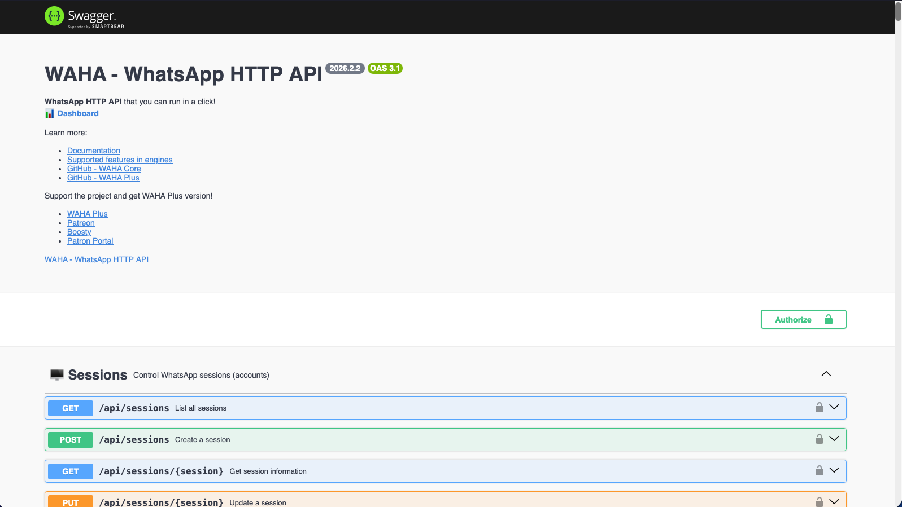

<!-- generated -->

# WAHA

1-Click installation template for WAHA on Easypanel

## Description

WAHA (WhatsApp HTTP API) is a self-hosted, privacy-focused WhatsApp API that you can run in a click! It provides a REST API to send and receive WhatsApp messages, manage groups, channels, and status updates. WAHA runs a real instance of WhatsApp Web to avoid getting blocked and supports automation through HTTP API. The core version is completely free with no limits on messages or time, making it perfect for WhatsApp automation, chatbots, and integrations.

## Instructions

After deployment, access the WAHA dashboard at your service domain. The
default username is &quot;admin&quot; and the password is auto-generated — check
the WAHA_DASHBOARD_PASSWORD environment variable in the service settings.
The same credentials are used for the Swagger API docs. The WAHA_API_KEY
is also auto-generated and required for API authentication.

## Benefits

- Self-hosted WhatsApp API: Run your own WhatsApp API server without relying on third-party services. Complete control over your data and privacy with no suspicious SaaS solutions.
- Free and unlimited: WAHA Core version is completely free with no limits on messages or time. No license expiration or subscription fees required.
- Easy to use REST API: Simple HTTP/REST API that works with any programming language - Python, JavaScript, PHP, C#, Go, Java, and more. Well-documented with Swagger.
- Real WhatsApp Web instance: Uses a real instance of WhatsApp Web under the hood to avoid getting blocked, ensuring reliable message delivery.

## Features

- Send and receive messages: Send and receive text messages, images, videos, voice messages, and documents through simple HTTP API calls.
- Groups and channels management: Create and manage WhatsApp groups, channels, and status updates. Automate group operations and channel broadcasting.
- Built-in dashboard: Web interface to easily manage your WhatsApp sessions, scan QR codes, and monitor your API usage.
- Webhook support: Receive real-time notifications via webhooks when new messages arrive or other events occur.
- Multiple sessions: Support for multiple WhatsApp accounts (sessions) within a single instance, perfect for scaling your automation.
- No blocking protection: Designed to minimize the risk of WhatsApp blocking by using real WhatsApp Web instances and following best practices.

## Links

- [Website](https://waha.devlike.pro/)
- [Github](https://github.com/devlikeapro/waha)
- [Documentation](https://waha.devlike.pro/docs)
- [Template Source](https://github.com/easypanel-io/templates/tree/main/templates/waha)

## Options

Name | Description | Required | Default Value
-|-|-|-
App Service Name | - | yes | waha
App Service Image | - | yes | devlikeapro/waha:latest-2026.2.2
Dashboard Username | - | yes | admin
Swagger Username | - | yes | admin

## Screenshots

## Change Log

- 2025-06-04 – First Release

## Contributors

- [Ahson Shaikh](https://github.com/Ahson-Shaikh)
