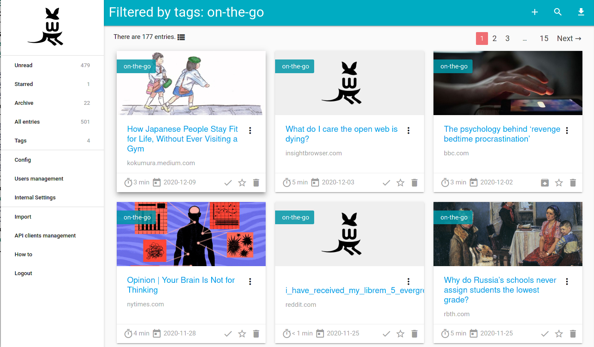

<!-- generated -->

# Wallabag

1-Click installation template for Wallabag on Easypanel

## Description

Wallabag is a self-hosted read-it-later application that allows you to save web articles and access them later in a clean, distraction-free format. Written in PHP, it enables you to store and organize articles, categorize them with tags, and sync across multiple devices. Wallabag is privacy-focused, supports importing from services like Pocket and Instapaper, and provides a RESTful API for integration with other tools. The app offers browser extensions, a mobile-friendly interface, and multiple export options, including PDF, ePub, and plain text.

## Benefits

- Save Articles for Later: Wallabag allows you to save web articles and read them later in a clean and ad-free format. This ensures distraction-free reading and improved focus on content.
- Multi-Device Synchronization: Your saved articles sync across multiple devices, allowing seamless reading on desktop, tablet, or smartphone. You can access your articles anywhere.
- Open-Source and Self-Hosted: Wallabag is fully open-source and can be self-hosted, ensuring complete control over your data while maintaining privacy and security.

## Features

- Browser Extensions: Wallabag offers browser extensions for Chrome, Firefox, and other browsers, making it easy to save articles with a single click.
- Full-Text Search: The built-in full-text search feature helps you find saved articles quickly by searching within the content.
- Tag Organization: Articles can be categorized with tags, making it easier to find relevant content and organize saved items efficiently.
- Multiple Export Formats: Wallabag allows you to export your saved articles in various formats, including PDF, ePub, and plain text, for offline access or backup.
- Import from Other Services: You can import your saved articles from Pocket, Instapaper, and other read-it-later services, making the transition seamless.

## Links

- [Documentation](https://doc.wallabag.org)
- [Github](https://github.com/wallabag/wallabag)
- [Template Source](https://github.com/easypanel-io/templates/tree/main/templates/wallabag)

## Options

Name | Description | Required | Default Value
-|-|-|-
App Service Name | - | yes | wallabag
App Service Image | - | yes | wallabag/wallabag:2.6.10

## Screenshots

## Change Log

- 2025-01-31 – First Release

## Contributors

- [Ahson Shaikh](https://github.com/Ahson-Shaikh)
