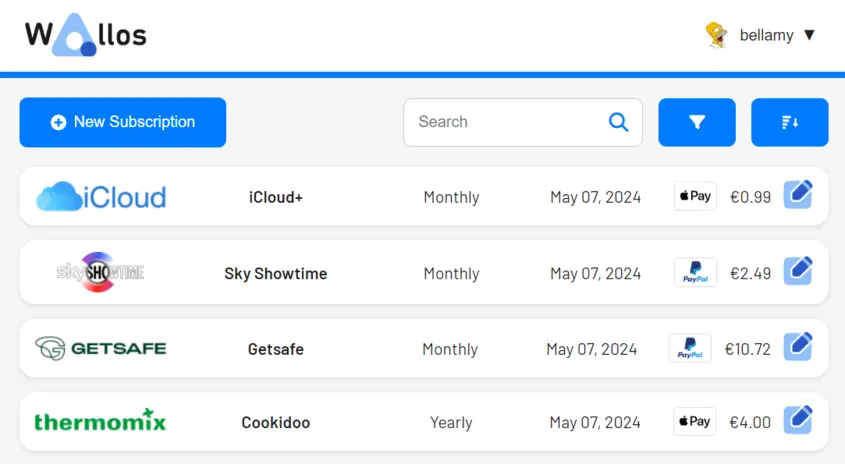

<!-- generated -->

# Wallos

1-Click installation template for Wallos on Easypanel

## Description

Wallos is an open-source, self-hosted network monitoring and management platform that provides comprehensive network visibility, device discovery, and network analytics. It helps network administrators monitor network health, track bandwidth usage, and manage network devices efficiently.

## Benefits

- Network Visibility: Gain complete visibility into your network infrastructure with real-time monitoring and detailed analytics.
- Device Discovery: Automatically discover and inventory all devices on your network for comprehensive asset management.
- Bandwidth Monitoring: Track bandwidth usage patterns and identify potential bottlenecks or unusual network activity.
- Self-Hosted: Keep your network data secure and private by hosting the monitoring platform on your own infrastructure.
- Open Source: Full transparency and customization capabilities with an active open-source community and regular updates.

## Features

- Network Monitoring: Real-time monitoring of network devices, services, and infrastructure with customizable alerts and notifications.
- Device Management: Comprehensive device inventory with detailed information about hardware, software, and network configuration.
- Performance Analytics: Advanced analytics and reporting tools to track network performance trends and identify optimization opportunities.
- Custom Dashboards: Create personalized dashboards to monitor specific aspects of your network infrastructure.
- API Integration: RESTful API support for integrating with existing network management tools and automation workflows.
- Multi-User Support: Role-based access control and multi-user support for team collaboration and secure network management.

## Links

- [Website](https://wallos.app/)
- [Documentation](https://docs.wallos.app/)
- [Github](https://github.com/ellite/Wallos)
- [Template Source](https://github.com/easypanel-io/templates/tree/main/templates/wallos)

## Options

Name | Description | Required | Default Value
-|-|-|-
App Service Name | - | yes | wallos
App Service Image | - | yes | bellamy/wallos:4.1.1

## Screenshots

## Change Log

- 2025-08-26 – First release

## Contributors

- [Ahson Shaikh](https://github.com/Ahson-Shaikh)
