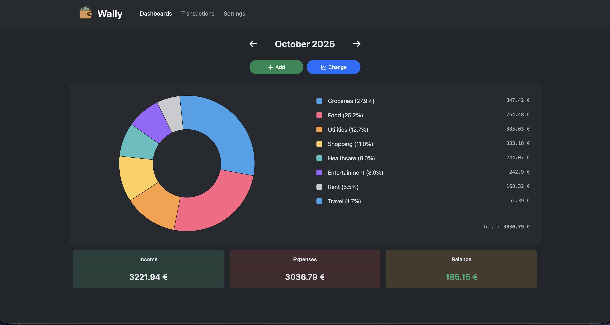

<!-- generated -->

# Wally

1-Click installation template for Wally on Easypanel

## Description

Wally is a lightweight web application designed for data management and tracking. It provides a clean web interface accessible through your browser, with persistent data storage to ensure your information is safely retained across restarts. The application can be pre-loaded with demo data for testing and evaluation purposes, making it easy to explore its features before using it with your own data. Wally runs efficiently in a containerized environment and requires minimal configuration to get started.

## Benefits

- Simple Deployment: Get started quickly with minimal configuration required. Deploy Wally with just a few settings and start using it immediately.
- Persistent Storage: All your data is stored persistently in a dedicated volume, ensuring nothing is lost when the container restarts or updates.
- Demo Mode: Test and explore the application with pre-loaded demo data before committing your own information, making evaluation easy.
- Web-Based Interface: Access Wally from any device with a web browser, no additional software installation required.

## Features

- Data Management: Store and manage your data with a user-friendly web interface that makes organization simple and efficient.
- Persistent Storage: All data is stored in a persistent volume mounted at /wally/data, ensuring your information survives container restarts and updates.
- Demo Mode: Optional demo mode that pre-loads the application with sample data, perfect for testing and evaluation before production use.
- Lightweight Container: Runs efficiently in a Docker container with minimal resource requirements, making it suitable for various hosting environments.
- Web Interface: Clean, modern web interface accessible through standard web browsers, providing easy access from desktop and mobile devices.
- Easy Configuration: Simple environment variable configuration allows you to customize the application behavior without complex setup procedures.

## Links

- [Documentation](https://github.com/polius/Wally/blob/main/README.md)
- [GitHub](https://github.com/polius/Wally)
- [Template Source](https://github.com/easypanel-io/templates/tree/main/templates/wally)

## Options

Name | Description | Required | Default Value
-|-|-|-
App Service Name | - | yes | wally
App Service Image | Wally Docker image | yes | poliuscorp/wally:1.14
Enable Demo Mode | Pre-load the app with random demo data | no | true

## Screenshots

## Change Log

- 2025-10-29 – Initial Template Release
- 2026-03-25 – Pinned Wally image to immutable 1.14 digest

## Contributors

- [Ahson Shaikh](https://github.com/Ahson-Shaikh)
