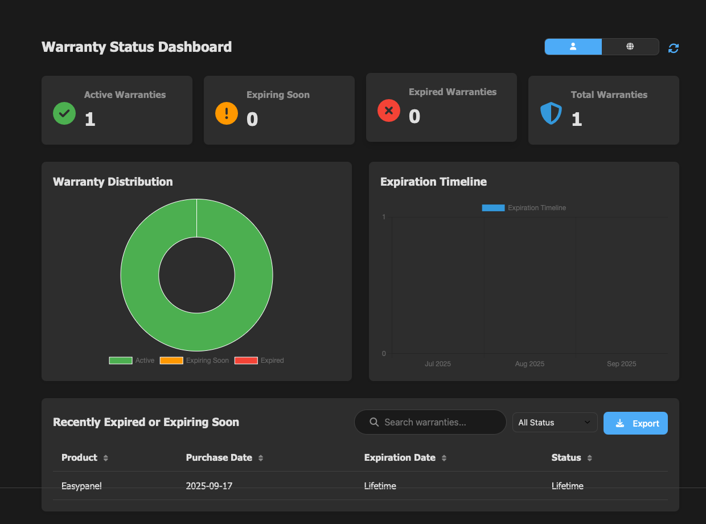
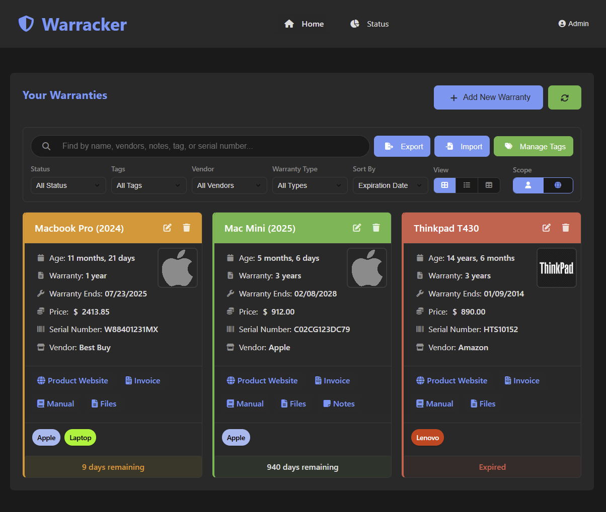

<!-- generated -->

# Warracker

1-Click installation template for Warracker on Easypanel

## Description

Warracker is a self-hosted warranty tracking application that helps you manage and track warranties for your products and assets. It provides a comprehensive solution for storing warranty information, tracking expiration dates, managing documentation, and receiving notifications about upcoming warranty expirations. Built with a modern web interface and PostgreSQL database for reliable data storage.

## Benefits

- Warranty Management: Centralized tracking of all your product warranties with expiration notifications and documentation management.
- Self-Hosted Control: Keep your warranty data completely private and secure on your own server with full control over your information.
- Email Notifications: Receive email notifications about upcoming warranty expirations to ensure you never miss important deadlines.

## Features

- Warranty Tracking: Track warranty information, expiration dates, and product details with a comprehensive database system.
- Document Management: Upload and store warranty documents, receipts, and related files with configurable upload size limits.
- Email Integration: SMTP integration for sending warranty expiration notifications and system alerts.
- OIDC SSO Support: Optional OpenID Connect single sign-on integration for enterprise authentication and user management.
- Memory Optimization: Configurable memory optimization modes for different deployment scenarios and resource constraints.
- Database Storage: Reliable PostgreSQL database for storing warranty data, user information, and application state with data persistence.

## Links

- [Github](https://github.com/sassanix/warracker)
- [Template Source](https://github.com/easypanel-io/templates/tree/main/templates/warracker)

## Options

Name | Description | Required | Default Value
-|-|-|-
App Service Name | - | yes | warracker
App Service Image | - | yes | ghcr.io/sassanix/warracker/main:0.10.1.11
SMTP Host | SMTP server hostname for email notifications | no | smtp.email.com
SMTP Port | SMTP server port | no | 465
SMTP Username | SMTP authentication username | no | youremail@email.com
SMTP Password | SMTP authentication password | no | password
Max Upload Size (MB) | Maximum file upload size in megabytes | no | 32
Enable OIDC SSO | Enable OpenID Connect single sign-on authentication | no | false
OIDC Provider Name | Name of the OIDC provider | no | oidc
OIDC Client ID | OIDC client ID from your provider | no | 
OIDC Client Secret | OIDC client secret from your provider | no | 
OIDC Issuer URL | OIDC issuer URL (e.g., https://your-provider.com/auth/realms/your-realm) | no | 
OIDC Scope | OIDC scope for authentication | no | openid email profile

## Screenshots

## Change Log

- 2025-09-17 – Template Release (v0.10.1.11)

## Contributors

- [Ahson Shaikh](https://github.com/Ahson-Shaikh)
