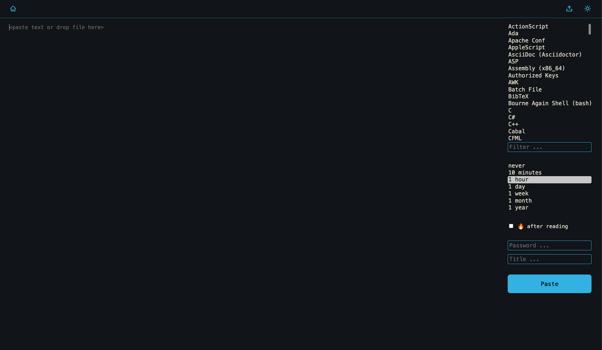

<!-- generated -->

# Wastebin

1-Click installation template for Wastebin on Easypanel

## Description

Wastebin is a self-hosted, minimal pastebin designed for quick and simple text sharing. With a clean and intuitive interface inspired by bin, it allows users to create and share text snippets easily. Wastebin supports private pastes, syntax highlighting, and expiration settings for better control over shared content. It is lightweight, fast, and easy to deploy with minimal system requirements.

## Instructions

In case of Sqlite write error. Go to your host machine and go the directory. &quot;cd /etc/easypanel/projects/your-project/wastebin/volumes/&quot; and do this &quot;chown -R 10001:10001 data/&quot; then redeploy.

## Benefits

- Minimal and Fast: Wastebin is designed to be lightweight and efficient, making it perfect for quick text-sharing needs without unnecessary features or bloat.
- Self-Hosted Privacy: Unlike public pastebin services, Wastebin allows you to host your own instance, ensuring full control over your data and privacy.
- Syntax Highlighting: Wastebin supports syntax highlighting for various programming languages, making it useful for sharing and reading code snippets with proper formatting.
- Expiration and Private Pastes: Users can set expiration times for pastes or mark them as private, ensuring better content management and control.

## Features

- Quick and Simple Text Sharing: Wastebin allows users to create and share pastes with a single click, making the process fast and convenient.
- Private and Public Pastes: Users can mark pastes as private, restricting access and keeping sensitive information secure.
- Expiration Control: Pastes can have configurable expiration times, allowing users to set content to auto-delete after a certain period.
- Syntax Highlighting: Automatic syntax highlighting for various programming languages helps in better readability of shared code snippets.
- Simple API: Wastebin provides a straightforward API for programmatic paste creation, making it useful for developers and automation workflows.

## Links

- [Documentation](https://github.com/quxfoo/wastebin/wiki)
- [Github](https://github.com/quxfoo/wastebin)
- [Template Source](https://github.com/easypanel-io/templates/tree/main/templates/wastebin)

## Options

Name | Description | Required | Default Value
-|-|-|-
App Service Name | - | yes | wastebin
App Service Image | - | yes | quxfoo/wastebin:3.2.0

## Screenshots

## Change Log

- 2025-03-17 – First Release (v3.0.0)
- 2025-07-25 – Version bumped to 3.2.0

## Contributors

- [Ahson Shaikh](https://github.com/Ahson-Shaikh)
