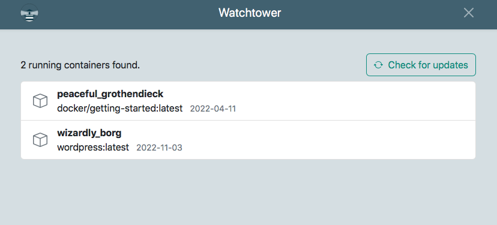

<!-- generated -->

# Watchtower

1-Click installation template for Watchtower on Easypanel

## Description

Watchtower is a process for automating Docker container base image updates. It monitors running containers and automatically updates them when their base image changes.

## Instructions

Mount `/var/run/docker.sock` in the Watchtower service to let it inspect and update running containers. Add the label `com.centurylinklabs.watchtower.enable=true` to each container you want Watchtower to manage, then enable label filtering in Watchtower. Set your preferred check interval or schedule, and add `--cleanup` to remove old image layers after successful updates.

## Benefits

- Automatic Updates: Automatically updates containers when new images are available
- Zero Downtime: Updates containers without service interruption
- Simple Setup: Easy to set up and requires minimal configuration
- Open Source: Free and open-source container update automation

## Features

- Container Monitoring: Monitors running containers for base image updates
- Automatic Updates: Automatically pulls and updates containers
- Docker Socket Access: Uses Docker socket to manage container updates
- Notification Support: Configurable notifications for update events
- Scheduling: Optional scheduling for update checks

## Links

- [Website](https://containrrr.dev/watchtower)
- [GitHub](https://github.com/containrrr/watchtower)
- [Documentation](https://containrrr.dev/watchtower/)
- [Template Source](https://github.com/easypanel-io/templates/tree/main/templates/watchtower)

## Options

Name | Description | Required | Default Value
-|-|-|-
App Service Name | - | yes | watchtower
App Service Image | - | yes | containrrr/watchtower:1.7.1

## Screenshots

## Change Log

- 2025-05-05 – Initial release

## Contributors

- [Ahson Shaikh](https://github.com/Ahson-Shaikh)
