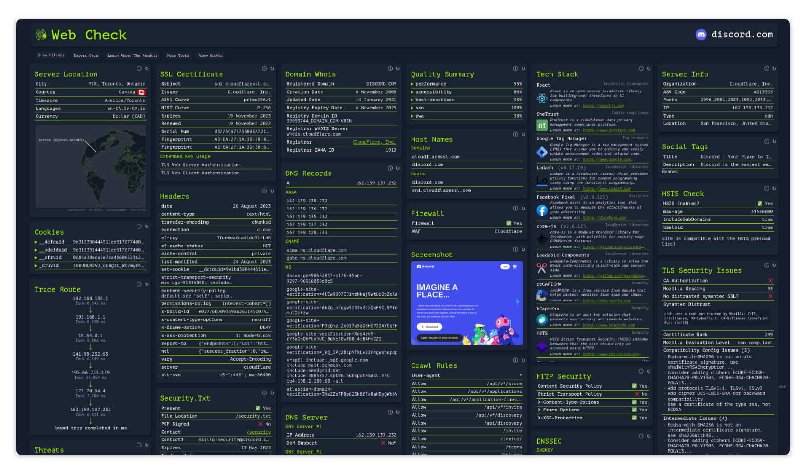

<!-- generated -->

# Web-Check

1-Click installation template for Web-Check on Easypanel

## Description

A comprehensive OSINT tool for analyzing websites, providing insights into security configurations, server architecture, and technologies.

## Benefits

- Comprehensive Analysis: Get detailed insights into any website's security, configuration, and technology stack.
- Easy Deployment: Simple deployment with Docker and automatic setup.
- Open Source: Free and open source with active community support.

## Features

- Security Analysis: Check SSL certificates, security headers, DNS security, and firewall configurations.
- Server Information: View IP info, server location, open ports, and infrastructure details.
- Technology Stack: Identify technologies, frameworks, and services used by the website.
- Performance Metrics: Analyze site performance, quality metrics, and carbon footprint.
- Domain Intelligence: Access DNS records, WHOIS data, associated domains, and more.

## Links

- [Website](https://web-check.xyz/)
- [Github](https://github.com/Lissy93/web-check)
- [Documentation](https://web-check.xyz/about)
- [Template Source](https://github.com/easypanel-io/templates/tree/main/templates/web-check)

## Options

Name | Description | Required | Default Value
-|-|-|-
App Service Name | - | yes | web-check
App Service Image | - | yes | lissy93/web-check

## Screenshots

## Change Log

- 2025-05-12 – First Release

## Contributors

- [Ahson Shaikh](https://github.com/Ahson-Shaikh)
