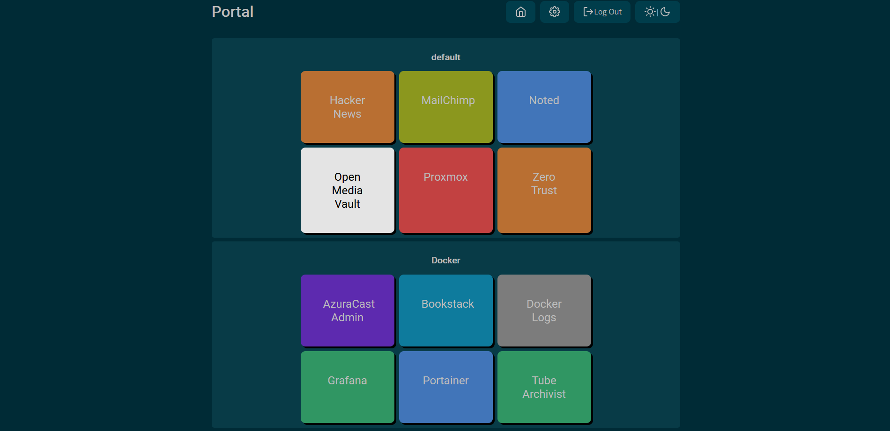

<!-- generated -->

# Web Portal

1-Click installation template for Web Portal on Easypanel

## Description

Web Portal is a lightweight and customizable dashboard application developed by enchant97. It provides a central hub for accessing your self-hosted applications and services. With a clean and intuitive interface, Web Portal helps you organize and access your web applications efficiently. It features a SQLite database for configuration storage and supports custom plugins for extended functionality. This containerized solution is perfect for home server enthusiasts and self-hosters looking for a clean, efficient way to manage their web applications.

## Benefits

- Centralized Dashboard: Web Portal provides a single, unified interface for accessing all your self-hosted applications and services, making navigation between them seamless and efficient.
- Customizable Experience: Tailor your dashboard to your specific needs with custom organization and plugin support for extended functionality.
- Lightweight and Fast: Built with efficiency in mind, Web Portal has minimal resource requirements while providing quick access to your applications.

## Features

- Application Directory: Organize and manage links to all your web applications in a clean, structured interface.
- SQLite Database: Configuration and data are stored in a simple SQLite database, making backup and migration straightforward.
- Plugin Support: Extend functionality with custom plugins that can be easily integrated into your Web Portal installation.
- Containerized Deployment: Easily deploy Web Portal in any environment that supports Docker with minimal setup.
- Secure Access: Protect your dashboard with security features to ensure only authorized users can access your application directory.

## Links

- [GitHub](https://github.com/enchant97/web-portal)
- [Container](https://github.com/enchant97/web-portal/pkgs/container/web-portal)
- [Template Source](https://github.com/easypanel-io/templates/tree/main/templates/web-portal)

## Options

Name | Description | Required | Default Value
-|-|-|-
App Service Name | - | yes | web-portal
App Service Image | - | yes | ghcr.io/enchant97/web-portal:2

## Screenshots

## Change Log

- 2025-04-17 – First Release

## Contributors

- [Ahson Shaikh](https://github.com/Ahson-Shaikh)
