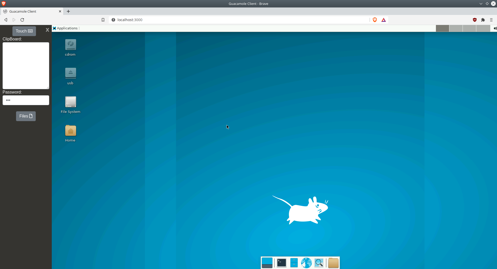

<!-- generated -->

# WebTop

1-Click installation template for WebTop on Easypanel

## Description

WebTop is a browser-based Linux desktop environment, self-hosted using Docker. It provides a full-featured desktop experience accessible from any device with a modern web browser. WebTop supports multiple desktop environments and applications, making it a versatile tool for productivity, remote work, and development.

## Benefits

- Browser-Based Desktop: Access a full Linux desktop environment directly from your web browser.
- Customizable Experience: Choose from multiple desktop environments like KDE, XFCE, and more.
- Lightweight and Secure: A lightweight solution for remote desktops, ensuring data privacy and security.

## Features

- Full Desktop Environment: Provides a complete Linux desktop accessible through a browser.
- Multi-User Support: Enable collaboration with multiple user sessions on the same instance.
- Application Support: Run various applications, including development tools, directly within the desktop.
- File Management: Built-in tools for managing and accessing your files.

## Links

- [Documentation](https://docs.linuxserver.io/images/docker-webtop/)
- [Github](https://github.com/linuxserver/docker-webtop)
- [Template Source](https://github.com/easypanel-io/templates/tree/main/templates/webtop)

## Options

Name | Description | Required | Default Value
-|-|-|-
App Service Name | - | yes | webtop
App Service Image | - | yes | lscr.io/linuxserver/webtop:ubuntu-kde-27d523f3-ls64

## Screenshots

## Change Log

- 2024-11-27 – Template Release

## Contributors

- [Ahson Shaikh](https://github.com/Ahson-Shaikh)
