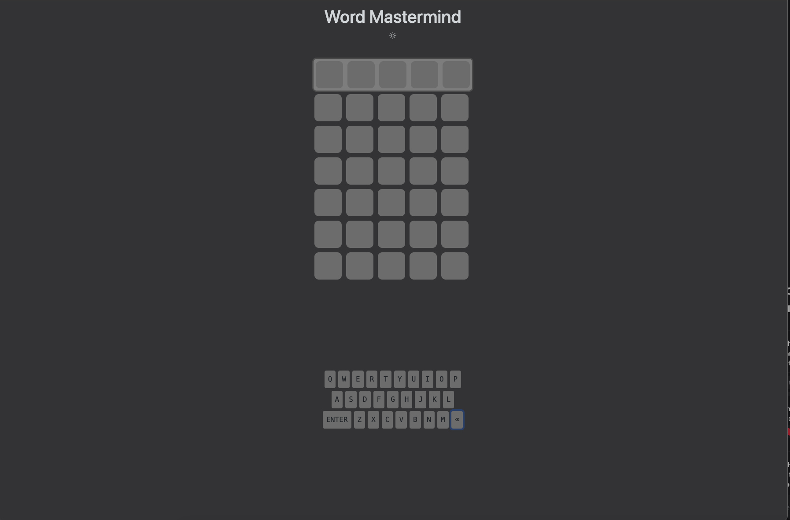

<!-- generated -->

# Word Mastermind

1-Click installation template for Word Mastermind on Easypanel

## Description

Word Mastermind is a word-guessing game inspired by the classic Mastermind puzzle and games like Wordle. Players attempt to guess a hidden word within a limited number of attempts, receiving feedback after each guess to help narrow down the solution. This containerized version provides a clean web interface that allows you to host your own instance of the game for personal use, educational purposes, or family entertainment.

## Benefits

- Educational Gaming: Improve vocabulary and logical reasoning skills through an engaging word-guessing game suitable for players of all ages.
- Self-Hosted Entertainment: Host your own instance of the game to enjoy with friends and family without relying on third-party services or dealing with advertisements.
- Lightweight Application: The game requires minimal server resources while providing a responsive and enjoyable gaming experience.

## Features

- Word Guessing Challenge: Test your vocabulary and deduction skills by guessing hidden words with helpful feedback after each attempt.
- Clean Web Interface: Enjoy the game through a simple, intuitive browser interface that works across desktop and mobile devices.
- Customization Options: Self-hosting allows for potential customization of game rules, word lists, and difficulty levels.
- Unlimited Play: Play as many games as you want without limitations, subscriptions, or hidden costs.
- Private Gaming: Keep your gaming activity private by hosting the application on your own infrastructure.

## Links

- [GitHub](https://github.com/clupasq/word-mastermind)
- [Container](https://github.com/clupasq/word-mastermind/pkgs/container/word-mastermind)
- [Template Source](https://github.com/easypanel-io/templates/tree/main/templates/word-mastermind)

## Options

Name | Description | Required | Default Value
-|-|-|-
App Service Name | - | yes | word-mastermind
App Service Image | - | yes | ghcr.io/clupasq/word-mastermind:latest

## Screenshots

## Change Log

- 2025-04-22 – first release

## Contributors

- [Ahson Shaikh](https://github.com/Ahson-Shaikh)
