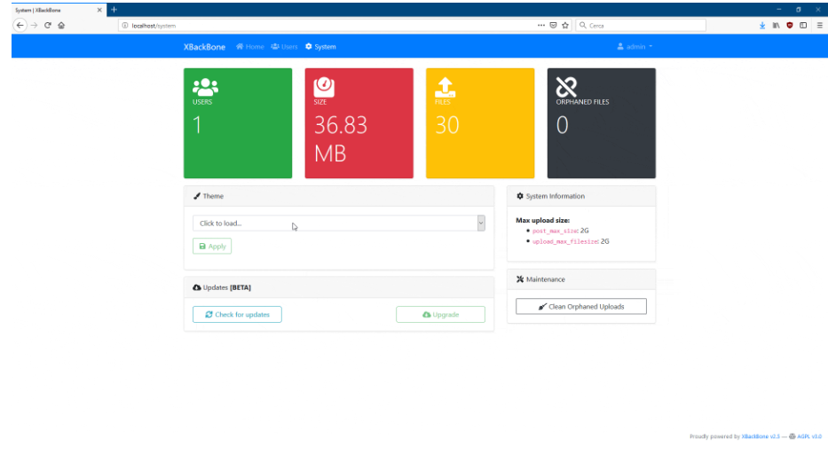

<!-- generated -->

# xBackbone

1-Click installation template for xBackbone on Easypanel

## Description

xBackbone is a versatile, self-hosted file and image sharing platform designed to manage and share content securely and efficiently. It features a clean and intuitive interface, supports multiple authentication options, and provides advanced file management capabilities. With xBackbone, you can maintain complete control over your shared content, ensuring privacy and flexibility.

## Instructions

Configure the Base URL and set up the database connection during installation.

## Benefits

- Secure File Sharing: xBackbone ensures your files and images are shared securely, maintaining full control over your data.
- Self-Hosted Solution: Stay in control of your content with a self-hosted platform that ensures privacy and flexibility.
- Custom Branding: Personalize the interface and share links with your own branding for a professional touch.

## Features

- File Management: Organize your uploads with an intuitive dashboard and detailed file properties.
- Authentication Options: Choose from multiple authentication methods, including LDAP, OAuth, and local accounts.
- Customizable Sharing: Share files and images with personalized links and permissions.
- Analytics Dashboard: Access insights into file access and sharing statistics.

## Links

- [Website](https://xbackbone.app/)
- [Github](https://github.com/SergiX44/XBackBone)
- [Template Source](https://github.com/easypanel-io/templates/tree/main/templates/xbackbone)

## Options

Name | Description | Required | Default Value
-|-|-|-
App Service Name | - | yes | xbackbone
App Service Image | - | yes | linuxserver/xbackbone:3.7.0

## Screenshots

## Change Log

- 2024-11-26 – Template Release

## Contributors

- [Ahson Shaikh](https://github.com/Ahson-Shaikh)
