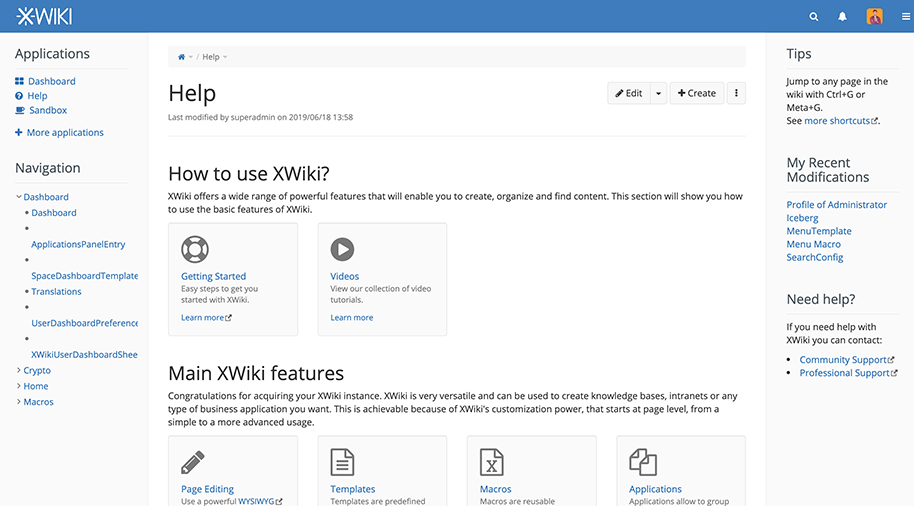

<!-- generated -->

# Xwiki

1-Click installation template for Xwiki on Easypanel

## Description

XWiki is a powerful, open source enterprise wiki platform designed for collaboration and content management. It offers extensive features to create, manage, and share knowledge effectively.

## Benefits

- Collaborative Editing: XWiki offers robust collaborative editing features for real-time teamwork.
- Enterprise Integration: XWiki seamlessly integrates with various enterprise systems for flexible workflows.
- Open Source Community: Built on an open source platform, XWiki benefits from a vibrant community and continuous innovation.

## Features

- Wiki Engine: Provides a powerful wiki engine for creating and managing content.
- WYSIWYG Editor: Enables easy content editing with a user-friendly interface.
- Extensible Architecture: Supports customization and extension to fit diverse organizational needs.
- Collaborative Tools: Includes tools for discussion, version control, and collaborative work.

## Links

- [Github](https://github.com/xwiki/xwiki-platform)
- [Template Source](https://github.com/easypanel-io/templates/tree/main/templates/xwiki)

## Options

Name | Description | Required | Default Value
-|-|-|-
App Service Name | - | yes | xwiki
App Service Image | - | yes | xwiki:16.4.7-mysql-tomcat

## Screenshots

## Change Log

- 2025-03-12 – First Release

## Contributors

- [Ahson Shaikh](https://www.github.com/Ahson-Shaikh)
