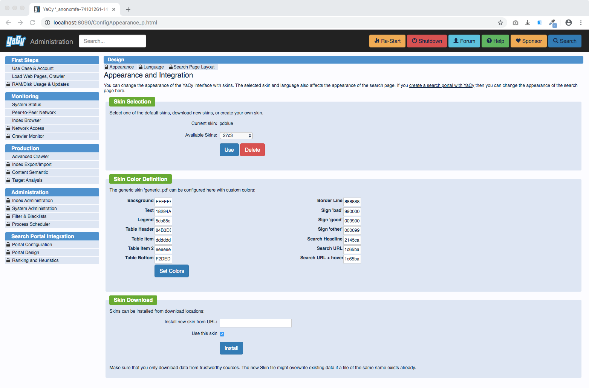

<!-- generated -->

# YaCy

1-Click installation template for YaCy on Easypanel

## Description

YaCy is a free distributed search engine built on principles of peer-to-peer networks. Unlike traditional search engines that rely on centralized servers, YaCy operates in a decentralized manner where each user can contribute to the search index. It allows you to run your own search portal, create your own web index, and be independent from commercial search engine providers. YaCy is perfect for organizations that need private search capabilities, intranet search solutions, or those who value privacy and freedom in their search experience.

## Benefits

- Decentralized Search: YaCy operates on a peer-to-peer network model, allowing users to create a distributed search engine independent of commercial providers.
- Privacy-Focused: Search without tracking or profiling. YaCy gives you complete control over your search data and index, ensuring your privacy is maintained.
- Customizable Index: Create and curate your own search index focusing on specific websites, intranets, or content areas that matter to your organization.

## Features

- Self-Hosted Search Engine: Run your own complete web search engine with crawling, indexing, and search capabilities all under your control.
- Intranet Search: Index and search internal documents and websites that aren't accessible to public search engines, ideal for company intranets.
- Web Administration Interface: Configure and monitor your YaCy instance through an intuitive web-based dashboard accessible from any browser.
- Full-Text Indexing: Index the complete content of websites with support for multiple file formats, including HTML, PDF, and other document types.
- Search API: Integrate YaCy search capabilities into your applications using the comprehensive API provided.

## Links

- [GitHub](https://github.com/yacy/yacy_search_server)
- [Website](https://yacy.net/)
- [Docker Hub](https://hub.docker.com/r/yacy/yacy_search_server)
- [Template Source](https://github.com/easypanel-io/templates/tree/main/templates/yacy)

## Options

Name | Description | Required | Default Value
-|-|-|-
App Service Name | - | yes | yacy
App Service Image | - | yes | yacy/yacy_search_server:1.93

## Screenshots

## Change Log

- 2025-04-18 – first release

## Contributors

- [Ahson Shaikh](https://github.com/Ahson-Shaikh)
