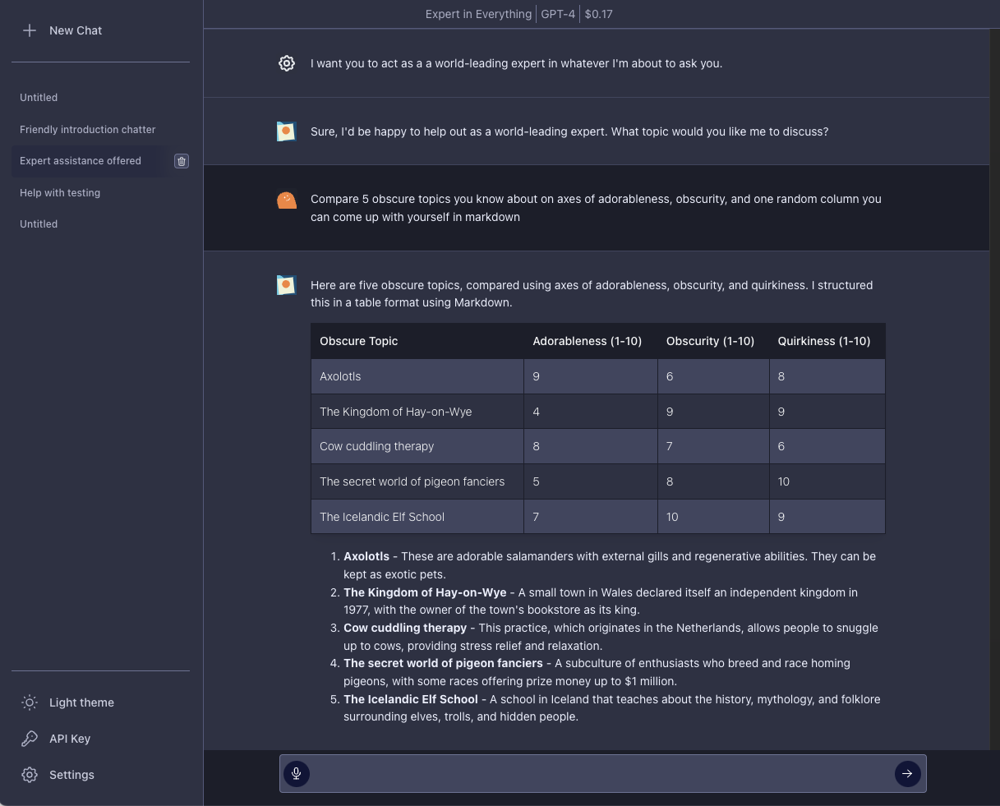

<!-- generated -->

# YakGPT

1-Click installation template for YakGPT on Easypanel

## Description

YakGPT is a simple, locally running ChatGPT UI that makes your text generation faster and chatting even more engaging! This hands-free interface provides direct access to OpenAI&#39;s GPT models with advanced voice capabilities, including Speech-to-Text via Azure &amp; OpenAI Whisper and Text-to-Speech via Azure &amp; Eleven Labs. Run locally in your browser with no need to install applications, featuring faster performance than the official ChatGPT UI by connecting directly to the API. Perfect for users who want privacy, speed, and voice interaction with their AI assistant.

## Benefits

- Hands-Free Voice Interaction: Advanced speech-to-text and text-to-speech capabilities for seamless voice conversations with AI.
- Privacy & Data Control: Use your own OpenAI API keys and store all data locally - no external analytics or tracking.
- Faster Than Official UI: Direct API connection provides faster response times compared to the official ChatGPT interface.

## Features

- GPT 3.5 & GPT 4 Support: Full access to OpenAI's latest language models via direct API integration.
- Speech-to-Text Integration: Convert your voice to text using Azure or OpenAI Whisper for hands-free input.
- Text-to-Speech Responses: Have AI responses read aloud using Azure or Eleven Labs text-to-speech.
- Browser-Based Interface: No installation required - runs entirely in your web browser with local storage.
- Microphone Integration: Easy mic integration with browser permissions for seamless voice interaction.
- Local Data Storage: All conversation history stored locally in localStorage with complete privacy control.

## Links

- [GitHub Repository](https://github.com/yakGPT/yakGPT)
- [Live Demo](https://yakgpt.vercel.app)
- [Template Source](https://github.com/easypanel-io/templates/tree/main/templates/yakgpt)

## Options

Name | Description | Required | Default Value
-|-|-|-
App Service Name | - | yes | yakgpt
App Service Image | - | yes | yakgpt/yakgpt:latest

## Screenshots

## Change Log

- 2025-07-02 – Initial release

## Contributors

- [Ahson Shaikh](https://github.com/Ahson-Shaikh)
