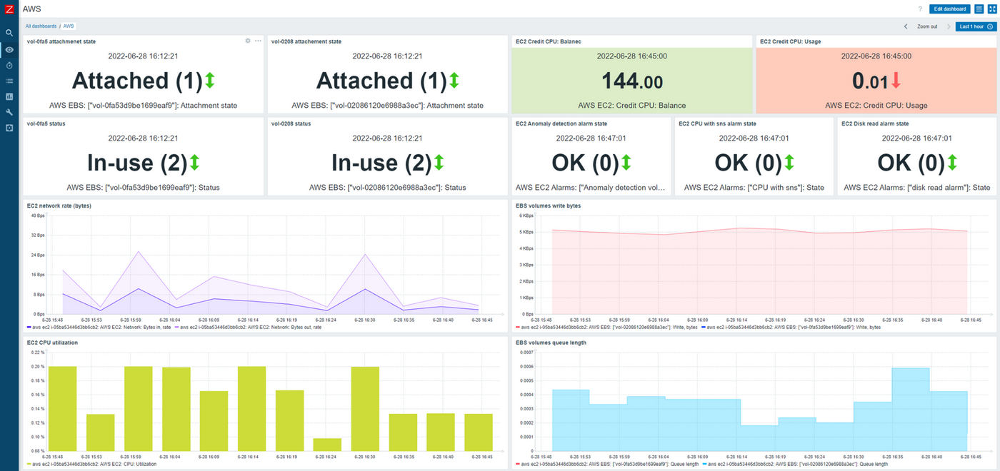

<!-- generated -->

# Zabbix

1-Click installation template for Zabbix on Easypanel

## Description

Zabbix is a powerful, self-hosted monitoring solution designed for tracking and analyzing system performance, network utilization, and application health. It provides real-time monitoring, customizable alerts, and detailed visualization tools to help administrators maintain system reliability. Zabbix supports agent-based and agentless monitoring, automation capabilities, and integration with third-party tools. With its flexible architecture, Zabbix is suitable for small to enterprise-level environments. The application includes a web-based dashboard and supports a variety of database backends, making it a robust solution for IT infrastructure monitoring.

## Instructions

Use the default credentials (Admin/zabbix) to log in.

## Benefits

- Comprehensive Monitoring: Zabbix provides real-time monitoring for servers, network devices, applications, and cloud environments, ensuring full visibility into system performance.
- Automation & Alerting: Zabbix includes automated alerting and remediation actions based on defined triggers, reducing downtime and improving system stability.
- Scalable & Flexible: Suitable for both small and large-scale enterprises, Zabbix supports distributed monitoring and high availability deployments.

## Features

- Agent-Based & Agentless Monitoring: Zabbix supports monitoring through both agent-based methods and SNMP, IPMI, JMX, and other agentless protocols.
- Customizable Dashboards: Zabbix offers advanced visualization tools, including interactive graphs, reports, and real-time monitoring dashboards.
- Built-In Notification System: Get alerts via email, SMS, or integrations with messaging platforms when critical issues are detected.
- API Integration: Extend Zabbix functionality with its powerful API for automating monitoring tasks and integrating with third-party tools.

## Links

- [Documentation](https://www.zabbix.com/documentation)
- [Github](https://github.com/zabbix/zabbix-docker)
- [Template Source](https://github.com/easypanel-io/templates/tree/main/templates/zabbix)

## Options

Name | Description | Required | Default Value
-|-|-|-
App Service Name | - | yes | zabbix
App Service Image | - | yes | zabbix/zabbix-web-nginx-pgsql:alpine-trunk
Zabbix Server Service Image | - | yes | zabbix/zabbix-server-pgsql:alpine-trunk
Zabbix Agent Service Image | - | yes | zabbix/zabbix-agent:alpine-trunk

## Screenshots

## Change Log

- 2025-02-27 – Template Release

## Contributors

- [Ahson Shaikh](https://github.com/Ahson-Shaikh)
