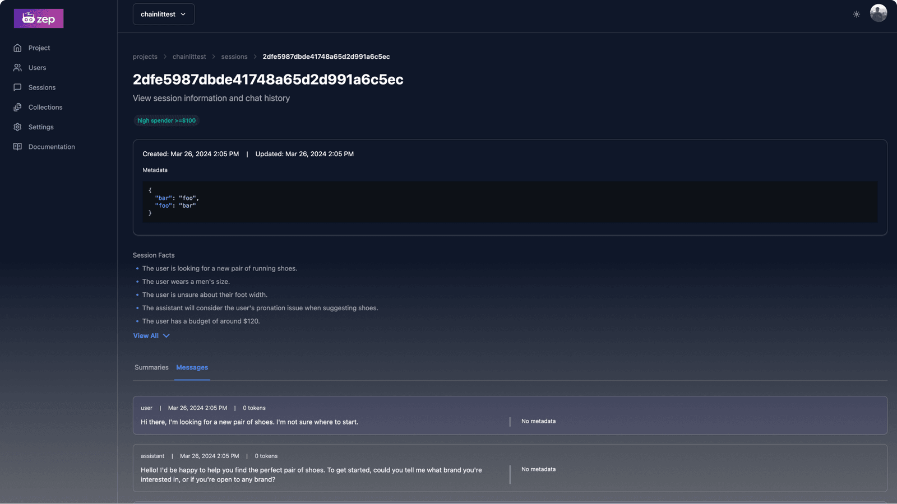

<!-- generated -->

# Zep

1-Click installation template for Zep on Easypanel

## Description

Zep is a powerful, self-hosted AI platform designed for seamless integration with large language models. It provides a clean and intuitive interface, supports plugins for extended functionality, and offers detailed analytics to monitor and optimize your AI workflows. With Zep, you maintain full control over your deployments and configurations. The application is accessible via your host on designated ports, ensuring secure and scalable operations. This container is based on Docker Baseimage KasmVNC, providing additional environment variables and configurations for enhanced flexibility. It also supports the docker manifest for multi-platform awareness, ensuring the correct image for your architecture.

## Instructions

Zep Community Edition can be used with any LLM provider that implements the OpenAI API.

## Benefits

- Seamless AI Integration: Zep offers a user-friendly interface for managing and interacting with large language models, enabling smooth integration with popular LLM providers.
- Self-Hosted Platform: Retain full control over your AI operations with a self-hosted platform designed for scalability and security.
- Custom Configurations: Tailor your deployment with a wide range of configuration options to meet your specific needs.

## Features

- API Integration: Seamlessly connect Zep with external tools using its robust API for flexible interaction.
- Extensible Architecture: Enhance platform functionality with support for community-built plugins and modules.
- Real-time Analytics: Monitor performance and usage through an integrated analytics dashboard that offers detailed insights.
- Flexible Workflows: Design custom AI workflows to optimize processes and adapt to your business requirements.

## Links

- [Documentation](https://www.getzep.com/)
- [Github](https://github.com/getzep/zep)
- [Template Source](https://github.com/easypanel-io/templates/tree/main/templates/zep)

## Options

Name | Description | Required | Default Value
-|-|-|-
App Service Name | - | yes | zep
App Service Image | - | yes | zepai/zep:1.0
Graphiti Service Image | - | yes | zepai/graphiti:0.3
Neo4j Service Image | - | yes | neo4j:5.22.0
OpenAI API Key | - | yes | 
OpenAI Base URL | - | yes | https://api.openai.com/v1/
OpenAI Model Name | - | yes | gpt-4o-mini

## Screenshots

## Change Log

- 2025-03-04 – Template Release (v1.0)

## Contributors

- [Ahson Shaikh](https://github.com/Ahson-Shaikh)
