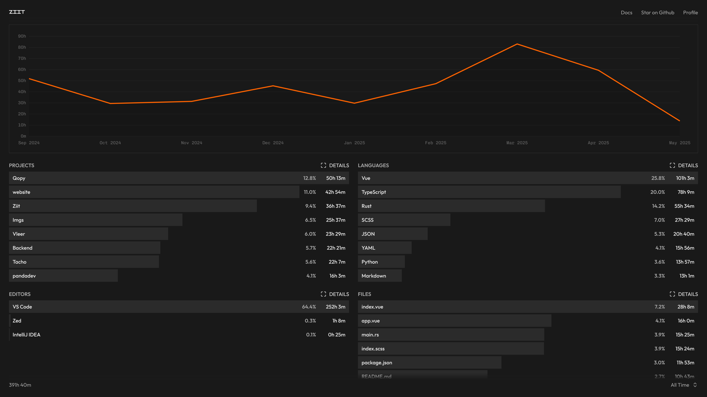

<!-- generated -->

# Ziit

1-Click installation template for Ziit on Easypanel

## Description

Ziit (pronounced &#39;tseet&#39;) is an open-source, self-hostable alternative to WakaTime. It provides a clean, minimal, and fast dashboard for displaying coding statistics, while ensuring privacy by keeping all data on your own server. Ziit tracks coding activity such as projects, languages, editors, files, branches, operating systems, and time spent coding, all presented in a familiar interface inspired by Plausible Analytics.

## Benefits

- Privacy-First Time Tracking: Keep all your coding statistics private and secure with a fully self-hosted solution that ensures your data never leaves your own server.
- Clean & Minimal Dashboard: Enjoy a clean, minimal interface inspired by Plausible Analytics that shows only the information you need without clutter or distractions.
- Comprehensive Coding Analytics: Track detailed coding activity including projects, languages, editors, files, branches, operating systems, and time spent coding with beautiful visualizations.

## Features

- IDE Integration: Time tracking directly from VS Code and JetBrains IDEs to your Ziit instance with seamless integration and real-time data synchronization.
- Data Import & Migration: Import your existing coding data from WakaTime or WakAPI instances to maintain continuity and historical statistics.
- Public Stats & Leaderboards: Share your coding statistics publicly and compete with others on the leaderboard to see who has the most coding hours.
- Embeddable Badges: Generate badges to embed coding time for specific projects directly into your README files or documentation.
- Flexible Time Filtering: Filter and analyze your coding activity using different time ranges to gain insights into your productivity patterns.
- Multi-Platform Support: Track coding activity across different operating systems, editors, and programming languages with detailed breakdowns.

## Links

- [Web App](https://ziit.app/login)
- [Documentation](https://docs.ziit.app)
- [Github](https://github.com/0pandadev/ziit)
- [Template Source](https://github.com/easypanel-io/templates/tree/main/templates/ziit)

## Options

Name | Description | Required | Default Value
-|-|-|-
App Service Name | - | yes | ziit
App Service Image | - | yes | ghcr.io/0pandadev/ziit:v1.0.2
PostgreSQL Service Image | - | yes | timescale/timescaledb:latest-pg17
GitHub Client ID | GitHub OAuth application client ID | yes | 
GitHub Client Secret | GitHub OAuth application client secret | yes | 
PASETO Key | generate your own key with "openssl rand -base64 32" | yes | CHaeP+t8UcMunRPMuHmQgL2VVU15q693VQxRu/BXnmM=

## Screenshots

## Change Log

- 2025-09-12 – Template Release

## Contributors

- [Ahson Shaikh](https://github.com/Ahson-Shaikh)
