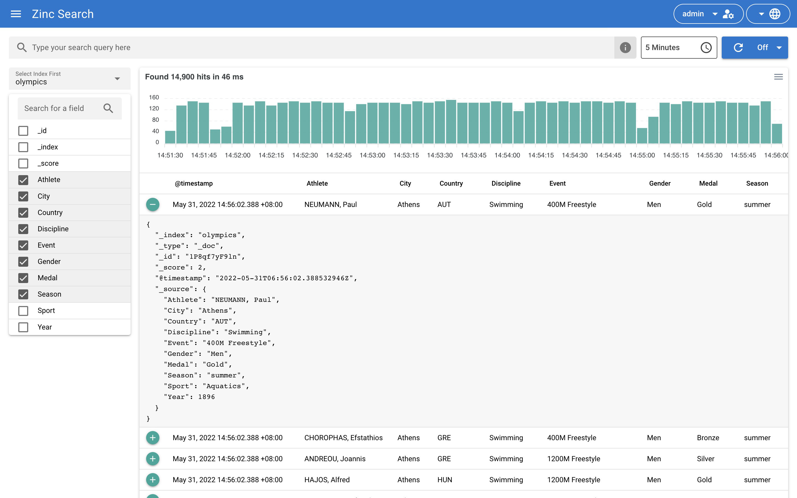

<!-- generated -->

# ZincSearch

1-Click installation template for ZincSearch on Easypanel

## Description

ZincSearch is a lightweight, fast, and modern search engine built in Go. It provides full-text search capabilities with a simple REST API, making it an excellent alternative to Elasticsearch for smaller to medium-scale applications. ZincSearch offers easy deployment, low resource consumption, and compatibility with Elasticsearch APIs.

## Instructions

Provide the admin password, or leave it blank to generate a random one.

## Benefits

- Lightweight Search Engine: Fast and resource-efficient search engine perfect for small to medium applications.
- Elasticsearch Compatible: Compatible with Elasticsearch APIs, making migration and integration easier.
- Easy Deployment: Simple setup with minimal configuration required to get started.

## Features

- Full-Text Search: Provides powerful full-text search capabilities with indexing support.
- REST API: Simple and intuitive REST API for all search and indexing operations.
- Low Resource Usage: Designed to be lightweight and efficient with minimal resource consumption.
- Built-in Dashboard: Includes a web-based dashboard for managing indexes and searching data.

## Links

- [Documentation](https://zincsearch-docs.zinc.dev/)
- [Github](https://github.com/zincsearch/zincsearch)
- [Template Source](https://github.com/easypanel-io/templates/tree/main/templates/zincsearch)

## Options

Name | Description | Required | Default Value
-|-|-|-
App Service Name | - | yes | zincsearch
App Service Image | - | yes | public.ecr.aws/zinclabs/zincsearch:0.4.10
Admin Username | - | yes | admin
Admin Password | Automatically generated if not provided | no | 

## Screenshots

## Change Log

- 2025-10-13 – Template Release

## Contributors

- [Ahson Shaikh](https://github.com/Ahson-Shaikh)
