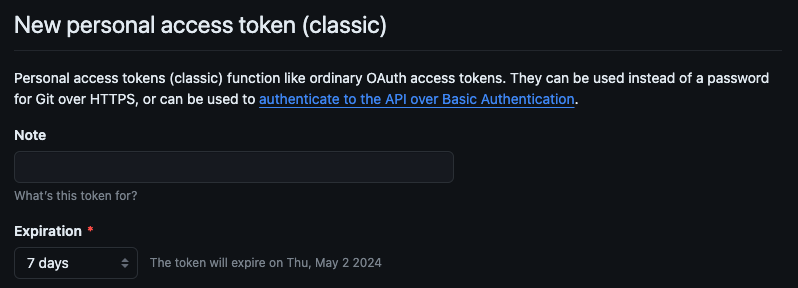
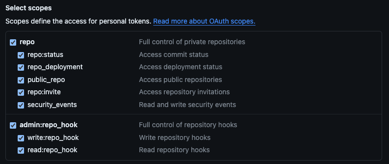
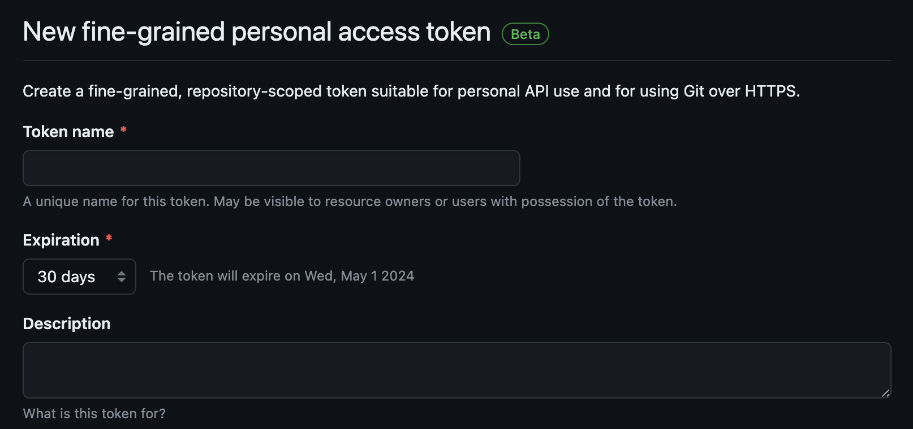
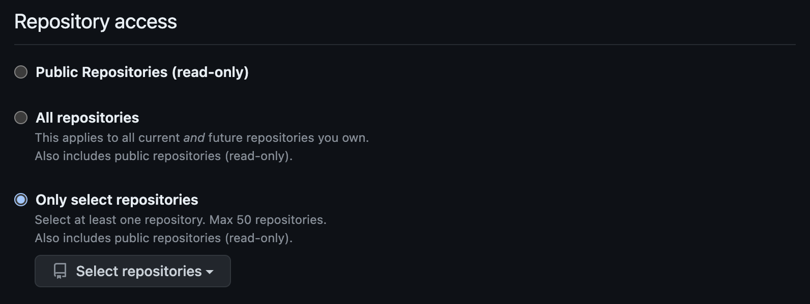
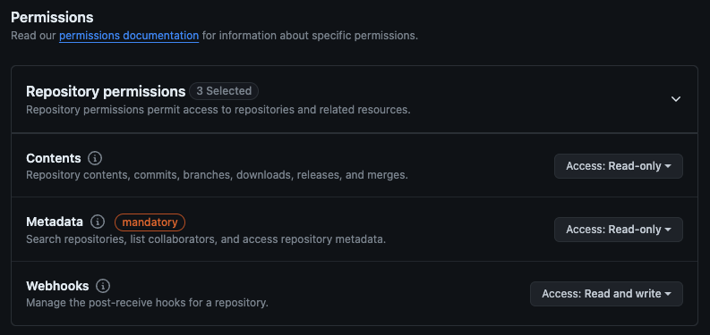

# GitHub API

Easypanel provides integration with the GitHub API using Personal Access Tokens.
GitHub currently provides 2 ways of generating these tokens:

- Classic tokens
- Fine-grained tokens

The main differences are the scopes between these tokens.
Classic can access all repositories, while fine-grained only provides access to specific repositories.
GitHub recommends the fine-grained solution, but the Classic token solution is also documented here.

## Classic tokens

When using a classic token, the configuration on GitHub consists of a couple of steps.
These steps can be configured from the [Tokens (classic)](https://github.com/settings/tokens) page through the "Generate new token"-button.

### Generic information

First, you'll need to provide some generic information regarding your token:

- A note, that will be used as the name, for the token (required, eventhough the UI does not represent this)
- When the token will expire

### Select scopes

Next, and finally, you'll need to select the required scopes this token may access.

| Scope           | Permission reason                                                              |
| :-------------- | :----------------------------------------------------------------------------- |
| repo            | To access the contents of your repositories                                    |
| admin:repo_hook | The auto-deploy feature (can be left out if you'll only do manual deployments) |

After selecting the scopes you can generate the token and configure it in Easypanel.

## Fine-grained tokens

For fine-grained tokens, you'll need to configure them in a couple of steps.
These steps can be configured from the [Fine-grained tokens](https://github.com/settings/tokens?type=beta) page through the "Generate new token"-button.

### Generic information

First, you'll need to provide some generic information regarding your token:

- A name for the token
- When the token will expire
- (Optional) A description for the token
- The resource owner (can be either your account, or an organization you have access to)

:::caution
If you update the expiration later on, it will re-generate the token value. This means you'll need to update the token in your Easypanel configuration with the new value.
:::

### Repository access

Next, you'll need to configure what repositories this token may access.
Your options are:

- Public repositories
- All repositories
- Select repositories

:::info
Do note, that if you select the "Select repositories"-option, you'll need to update this list when Easypanel needs access to another repository.
Updating this list will not update the value of the token, so there's no need to replace it within Easypanel.
:::

### Repository permissions

Finally, it's time to select the repository permissions that are needed for Easypanel. Most of the permissions you'll need will be read-only, with the exception being the Webhooks permission (for the autodeploy feature).

| Permission | Access level   | Permission reason                                                              |
| :--------- | :------------- | :----------------------------------------------------------------------------- |
| Metadata   | Read-only      | It's required by GitHub.                                                       |
| Contents   | Read-only      | To access the contents of the repository.                                      |
| Webhooks   | Read and write | The auto-deploy feature (can be left out if you'll only do manual deployments) |

## Adding the token to Easypanel

1. Go to **Settings** > **Github** and paste your token.

2. If the token is valid you will get a message saying "Github token updated"
